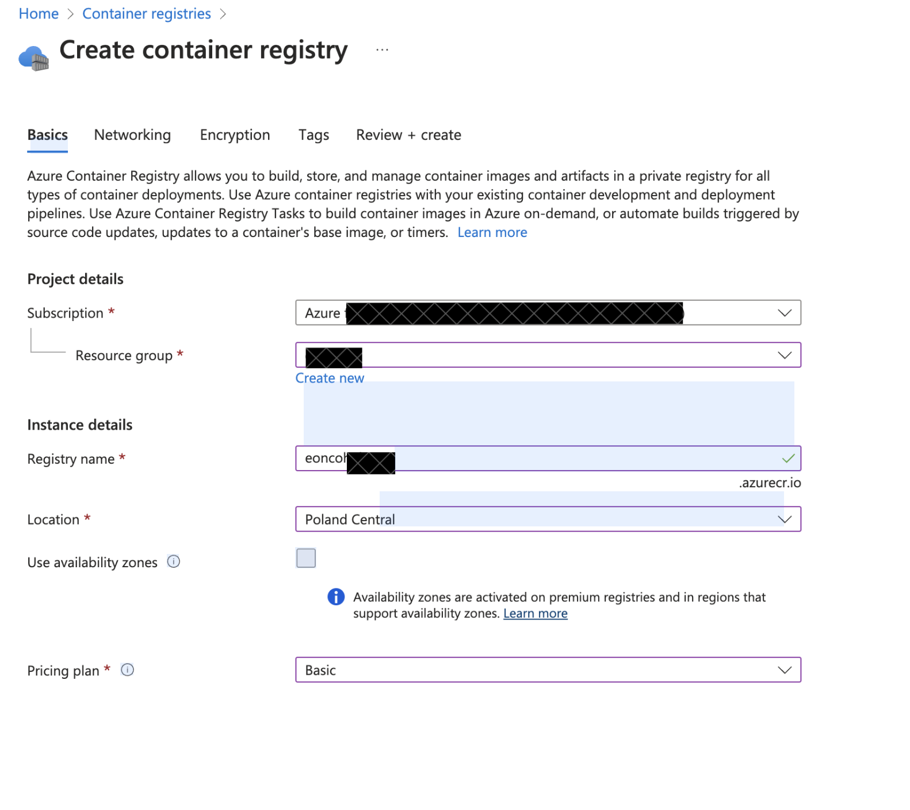

# Deploy Go Microservices Module on Azure Container App

A comprehensive guide to deploying Go microservices on Azure Container App platform.

## Prerequisites
- Azure account with active subscription
- Docker Desktop installed
- Go development environment
- [Azure CLI](https://learn.microsoft.com/en-us/cli/azure/install-azure-cli) installed

## Table of Contents
- [Step 1: Prepare Your Go Application](#step-1-prepare-your-go-application)
- [Step 2: Set Up Azure Resources](#step-2-set-up-azure-resources)
- [Step 3: Configure Local Development Environment](#step-3-configure-local-development-environment)
- [Step 4: Deploy to Azure Container Instance](#step-4-deploy-to-azure-container-instance)
- [Troubleshooting](#troubleshooting)

## Step 1: Prepare Your Go Application

### Create Dockerfile
Create a Dockerfile in your project root directory with the following configuration:

```dockerfile
# Development stage
FROM golang:1.23-alpine AS development

# Install Air for live reload
RUN go install github.com/air-verse/air@latest

# Set up working directory
WORKDIR /app

# Copy dependency files
COPY go.mod go.sum ./

# Install dependencies
RUN go mod download

# Copy application source
COPY . .
```

## Step 2: Set Up Azure Resources

### Install Azure CLI
1. Install Azure CLI following the [official documentation](https://learn.microsoft.com/en-us/cli/azure/install-azure-cli)
2. Verify installation by running:
   ```bash
   az version
   ```

### Create Azure Container Registry
1. Navigate to Azure Portal
2. Create a new Container Registry (example name: `eoncohubapp`)
3. Note down the registry name for later use



## Step 3: Configure Local Development Environment

### Azure Authentication
1. Login to Azure:
   ```bash
   az login
   ```

2. Connect to Container Registry:
   ```bash
   az acr login --name <container_registry_name>
   ```
   Wait for "Login Succeeded" message

### Docker Image Management
1. List available Docker images:
   ```bash
   docker images
   ```

2. Tag your image:
   ```bash
   docker tag <image_name> eoncohubapp.azurecr.io/<repository_name>
   ```

3. Push to Azure Container Registry:
   ```bash
   docker push eoncohubapp.azurecr.io/<repository_name>
   ```

4. Verify in Azure Portal:
   - Navigate to Container Registry
   - Go to Services → Repositories
   - Confirm your repository is listed

## Step 4: Deploy to Azure Container Instance

### Container Instance Creation
1. In Azure Portal, create new Container Instance
2. Select "Azure Container Registry" as Image Source
3. Configure networking settings:
   - Ensure port configuration matches Dockerfile
   - Set up any required environment variables

### Enable Admin Access
If you encounter the admin user error, run:
```bash
az acr update -n <acrName> --admin-enabled true
```

## Troubleshooting

### Authentication Issues
If your token expires or you're on the wrong subscription:
```bash
az login --scope https://management.core.windows.net//.default
```

### Common Issues
- Ensure Docker Desktop is running
- Verify correct port mappings
- Check resource group permissions
- Confirm registry name is correct

### Best Practices
- Use meaningful tags for your images
- Implement proper logging
- Set up monitoring and alerts
- Regular security updates

---

Need help? Contact Azure Support or refer to the [official documentation](https://docs.microsoft.com/azure).
