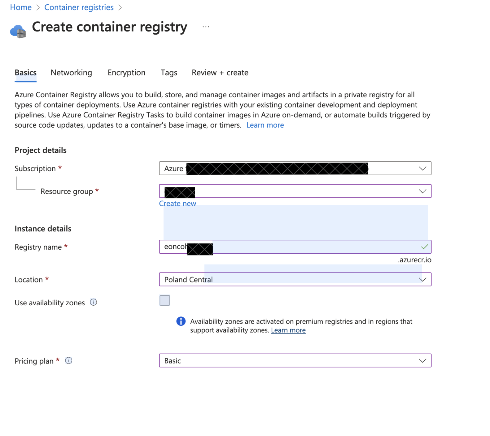

# Deploy Go microservices module on Azure Container App

## Step 1 

- **Create the module with the Dockerfile**

- Example of Dockerfile:

```dockerfile
# Development stage
FROM golang:1.23-alpine AS development

# Install Air
RUN go install github.com/air-verse/air@latest

# Set the working directory
WORKDIR /app

# Copy go mod and sum files
COPY go.mod go.sum ./

# Download all dependencies
RUN go mod download

# Copy the source code
COPY . .
```

## Step 2

- **Create the Azure Resources and install Azure CLI**

- Install [Azure CLI](https://learn.microsoft.com/en-us/cli/azure/install-azure-cli)

- Test running this command: <code>az</code>

- Create an Azure Container Registry 


eoncohubapp


## Step 3

- **Connect to the Azure Resources from local machine**

- Login to Azure using Azure CLI running the next command

```azcli
az login
```
- Open the Docker Desktop 

- Connect to the Container Registry:

```azcli
az acr login --name <container_registry_name>
```

- Wait the message <i>Login Succeeded</i>

- Look for available Docker images:

```bash
docker images
```

- Copy the name of the Docker image you want to push

- Tag the Docker Image:

```bash
docker tag <image_name> eoncohubapp.azurecr.io/<create_a_repo_name>
```

- Push the image:

```bash
docker push eoncohubapp.azurecr.io/<same_image_name>
```

- Check the repo on Azure Portal (go to Container Registry -> Services -> Repositories -> Check your repo here)

## Step 4

- **Create the Azure Container Instance**

- Use the Azure Portal to create a Container Instance

- On Image Source select Azure Container Registry

- You will see an error:

```
Admin user must first be enabled for this registry in order to access the image during the container instance creation.Learn about the admin user in ACR.
```

- To fix it, run this in your terminal

```bash
az acr update -n <acrName> --admin-enabled true
```

!!! Important: ensure that you loged in to the correct subscription. If you are not see Relevant info section, point 1 to fix it. 

- Check the Network tab on Azure Portal. Introduce the right port from Dockerfile


## Relevant info:

1. Your token may expire during this process or you could login on the wrong subscription. If so, run this command in terminal to relogin:

```bash
az login --scope https://management.core.windows.net//.default
```